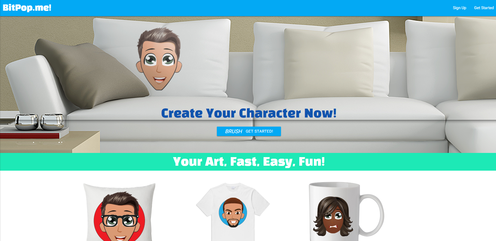
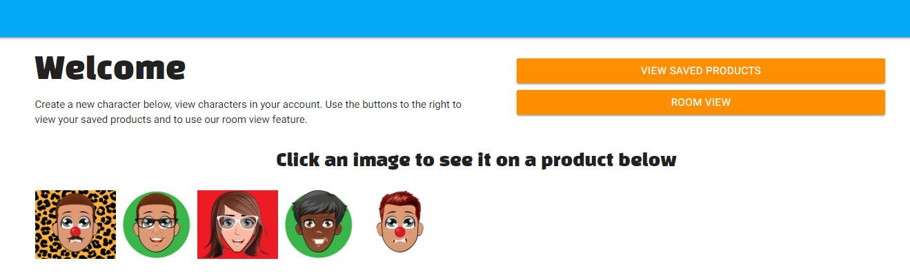
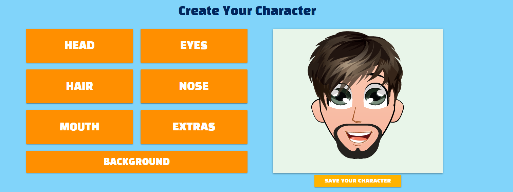
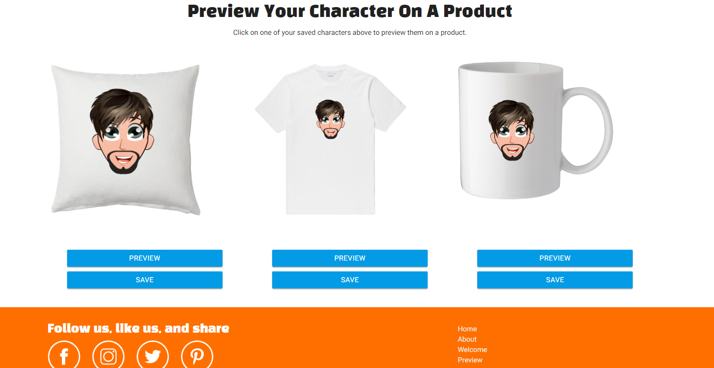

# BitPop.me!

## About the App

Bitpop is an avatar creator. It allows a user to create a character and preview their creation on different products that the website offers.

*This app is still a work in progress. 

### Technologies Used 
MERN Stack: React JS, React-Materialize, Node JS, Express JS, Mongo DB, Mongoose, React-Router, Axios, Fabric JS, A frame, HTML Canvas.

### Welcome to BitPop.me

Demo: [View the App](https://stark-meadow-68885.herokuapp.com/)

This is the dashboard page [click here](https://stark-meadow-68885.herokuapp.com/saved). You can get there by clicking the "Get Started" link in the nav bar on the home page.

View Saved Products: Will bring up a modal with images of products the user has saved using the save products button at the bottom of the page.

Room View: This will open a new page and turn the users camera on to view there latest avatar in AR using the marker [HERE](https://pbs.twimg.com/media/C8j9bSHXkAUNSoh.jpg).

Below "Welcome" you will find all the avatars saved to the users account.

This is the Character or Avatar Creator section of the dashboard page.

Create a character by clicking on one of the buttons. A modal will appear with options for the corresponding button. The option clicked with then be added to the canvas, and the user will click on the next feature they would like to add.

When the user is happy with their new character they can save it by clicking the "Save Your Character" button.

It will be added to the characters above the creator section.

Clicking on one of the saved characters above the creator section will add it to the product preview section.

Click Preview to view a bigger image of the product with the character on it or click save to save the product to the user account.

Below is a look at what the "Room View" AR button will display while holding the [Hiro](https://pbs.twimg.com/media/C8j9bSHXkAUNSoh.jpg) marker up to the camera.

